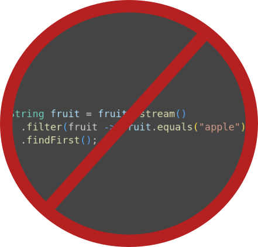

  
  

Welcome to the documentation for the <strong>λLoop</strong> library.

λLoop provides a fluent and expressive way to create loops in Java.

  

&nbsp;

## Topics

* [Introduction](introduction.md)
* [Getting Started](getting-started.md)
* [Tutorial](tutorial.md)
* [Changelog](../CHANGELOG.md)